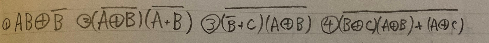
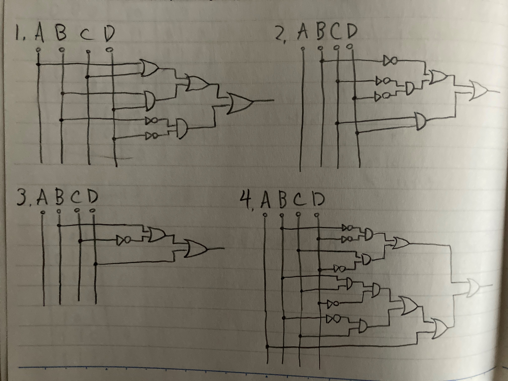
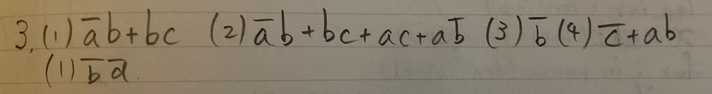

### Binary Logic Worksheet

## Question1

## Question2

## Question3

## Question4

window------------------> w
maindoor----------------> m
baranda-----------------> b
TV----------------------> T
washing maching---------> l
dish washing machine----> d
tap in the bathroom-----> t
tap in the kitchen------> k
closet door-------------> c
door to bedroom---------> p
door to sorage room-----> s
