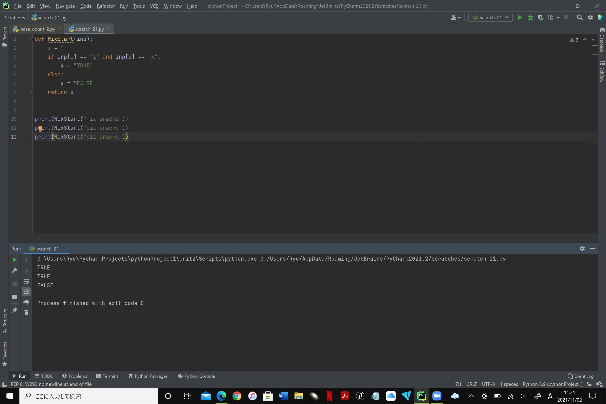
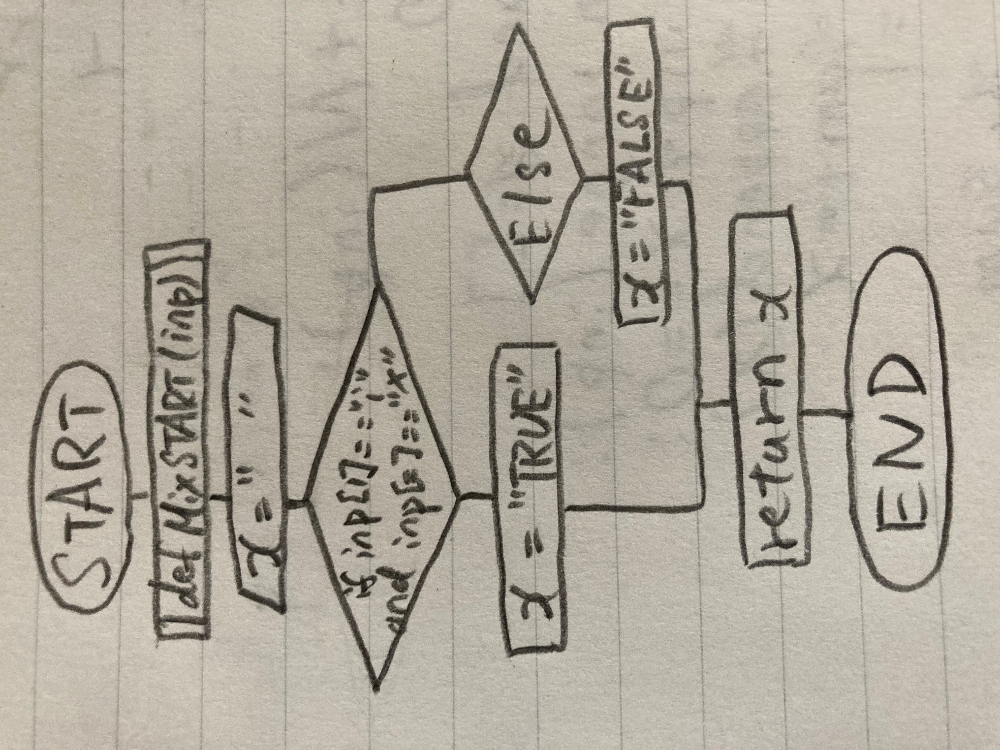

### Outout TRUE if the given string begins with 'mix', except the 'm' can be anything, so 'pix', '9ix'..., all count.

```.py
def MixStart(inp):
    x = ""
    if inp[1] == "i" and inp[2] == "x":
        x = "TRUE"
    else:
        x = "FALSE"
    return x
```



