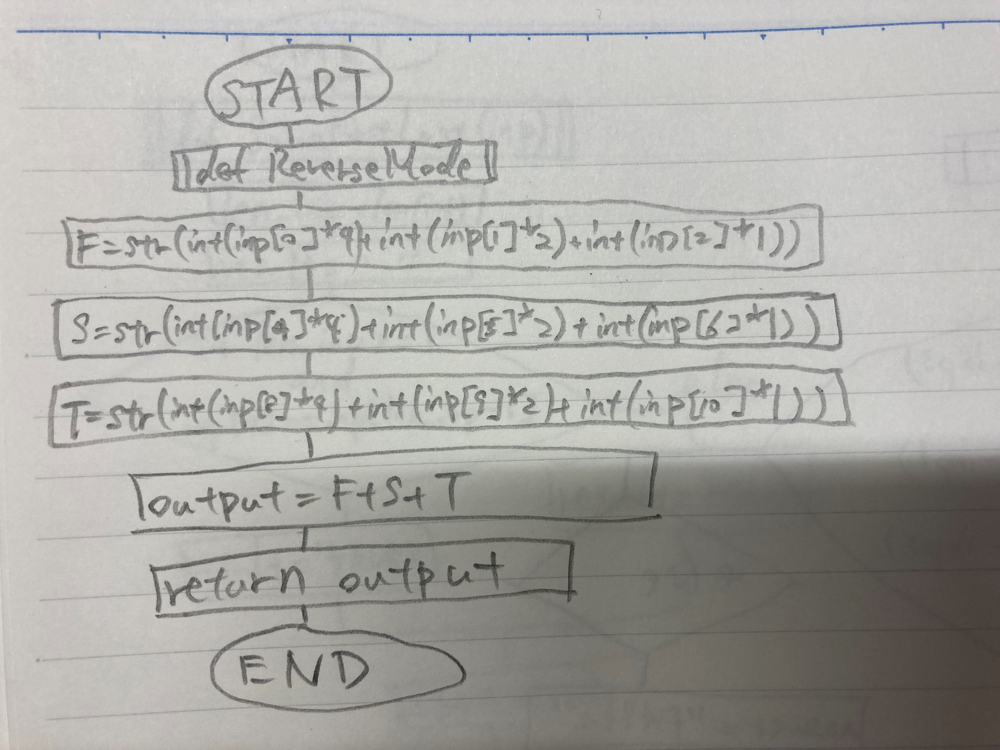
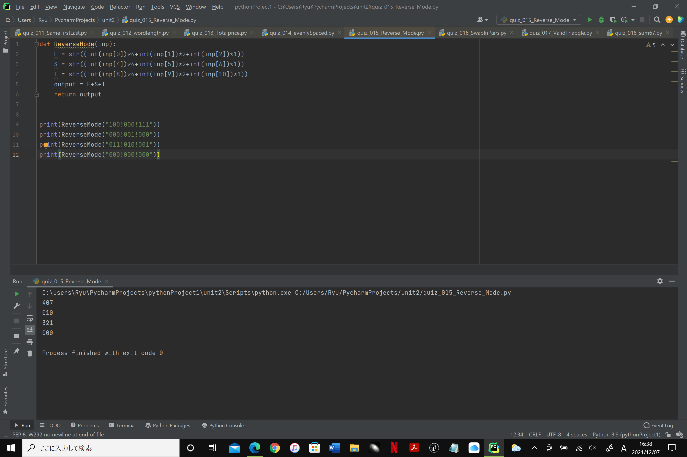

### ReverseMode

```.py
def ReverseMode(inp):
    F = str((int(inp[0])*4+int(inp[1])*2+int(inp[2])*1))
    S = str((int(inp[4])*4+int(inp[5])*2+int(inp[6])*1))
    T = str((int(inp[8])*4+int(inp[9])*2+int(inp[10])*1))
    output = F+S+T
    return output
```




