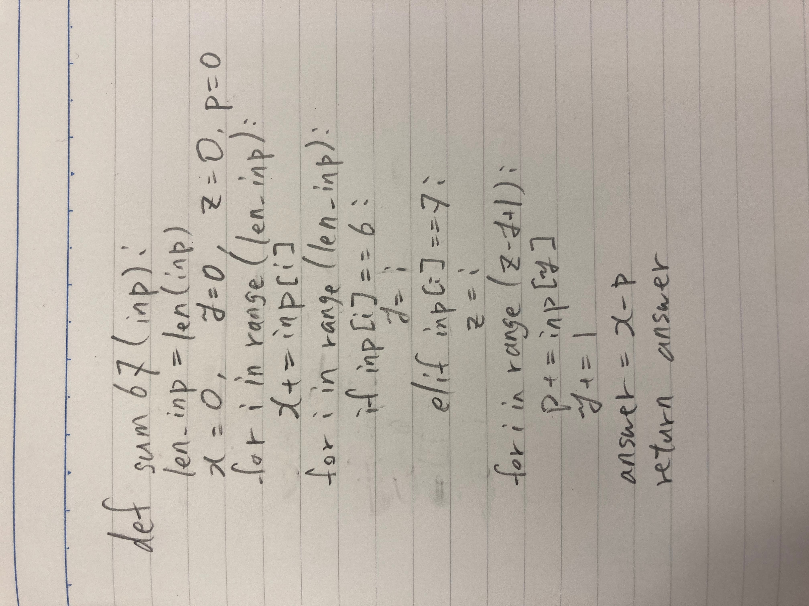
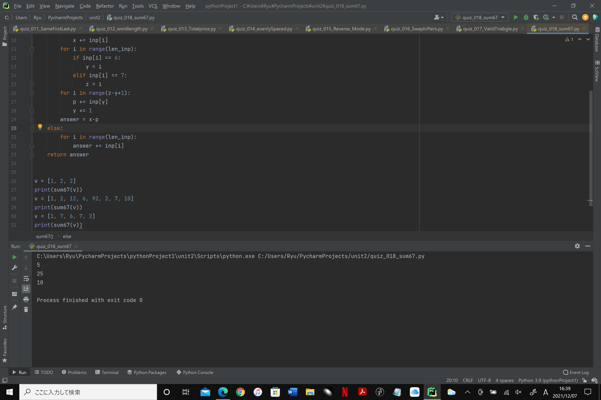

### sum67

```.py
def sum67(inp):
    len_inp = len(inp)
    x = 0
    y = 0
    z = 0
    p = 0
    answer = 0
    if 6 in inp:
        for i in range(len_inp):
            x += inp[i]
        for i in range(len_inp):
            if inp[i] == 6:
                y = i
            elif inp[i] == 7:
                z = i
        for i in range(z-y+1):
            p += inp[y]
            y += 1
        answer = x-p
    else:
        for i in range(len_inp):
            answer += inp[i]
    return answer
```




