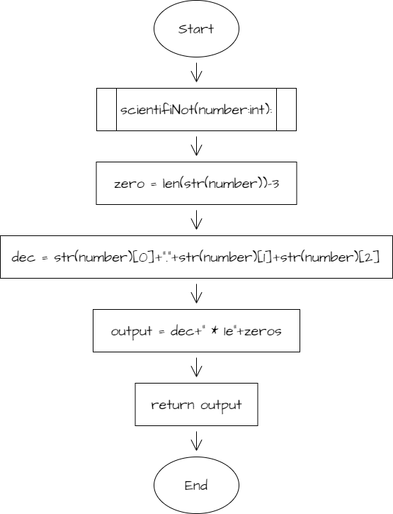

### scientifiNot

```.py
def scientifiNot(number:int):
    zeros = len(str(number))-1
    dec = str(number)[0]+"."+str(number)[1]+str(number)[2]
    output = f"{dec} * 1e{zeros}"
    return output
```




