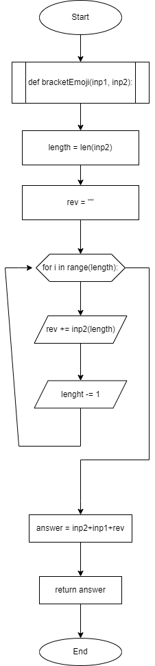
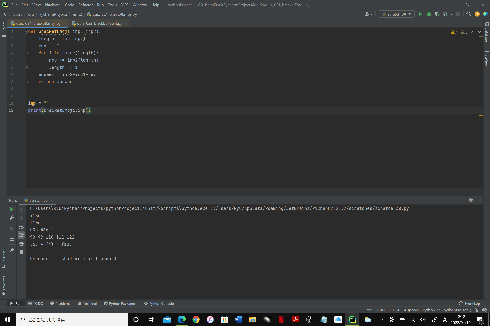

 ### bracketEmoji
 
 ```.py
 def bracketEmoji(inp1,inp2):
    length = len(inp2)
    rev = ""
    for i in range(length):
        rev += inp2(length)
        length -= 1
    answer = inp2+inp1+rev
    return answer
```




